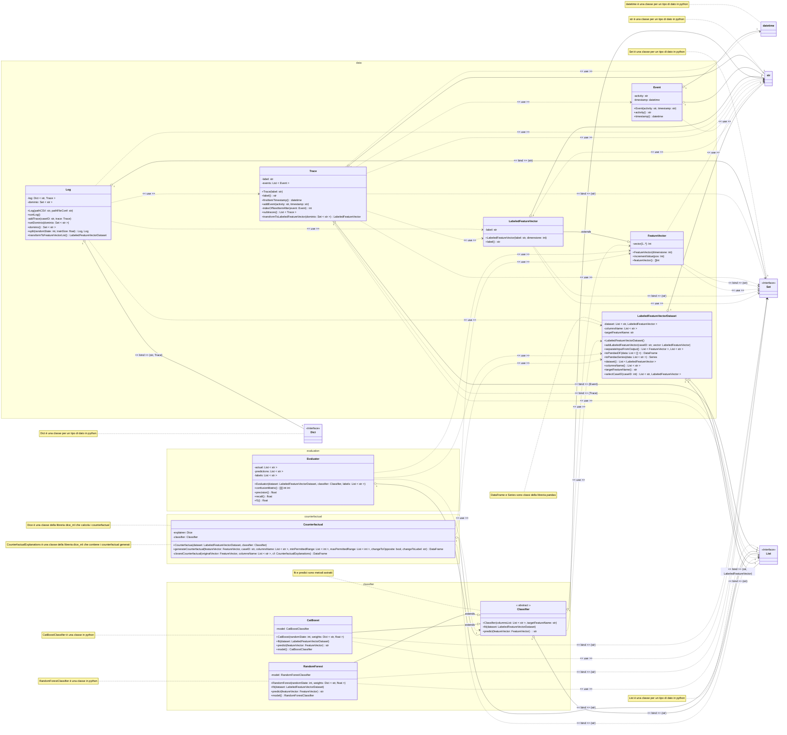

```mermaid
classDiagram
    direction LR
    note for datetime "datetime è una classe per un tipo di dato in python"
    note for Dict "Dict è una classe per un tipo di dato in python"
    note for str "str è una classe per un tipo di dato in python"
    note for List "List è una classe per un tipo di dato in python"
    note for Set "Set è una classe per un tipo di dato in python"
    note for RandomForest "RandomForestClassifier è una classe in python"
    note for CatBoost "CatBoostClassifier è una classe in python"
    note for Classifier "fit e predict sono metodi astratti"
    note for LabeledFeatureVectorDataset "DataFrame e Series sono classi della libreria pandas"
    note for Counterfactual "Dice è una classe della libreria dice_ml che calcola i counterfactual"
    note for Counterfactual "CounterfactualExplanations è una classe della libreria dice_ml che contiene i counterfactual generati"
    Log "1" o-- "1" Dict : << bind >> (str, Trace)
    Trace "1" o-- "1" List : << bind >> (Event)
    Trace "1" o-- "1" str
    Event "1" o-- "1" str
    Event "1" o-- "1" datetime
    LabeledFeatureVector "1" o-- "1" str
    Log "1" o-- "1" Set : << bind >> (str)
    Evaluator "1" o-- "3" List : << bind >> (str)
    Classifier "1" o-- "1" List : << bind >> (str)
    Classifier "1" o-- "1" str
    Log ..> LabeledFeatureVector : << use >>
    Log ..> Trace : << use >>
    Log ..> str : << use >>
    Log ..> LabeledFeatureVectorDataset : << use >>
    Trace ..> str : << use >>
    Event ..> str : << use >>
    FeatureVector ..> str : << use >>
    LabeledFeatureVector ..> str : << use >>
    Trace ..> Event : << use >>
    Trace ..> List : << bind >> (Trace)
    Trace ..> List : << use >> 
    Trace ..> Set : << bind >> (str)
    Trace ..> Set : << use >> 
    Trace ..> LabeledFeatureVector : << use >>
    FeatureVector ..> Set : << bind >> (str)
    FeatureVector ..> Set : << use >>
    LabeledFeatureVector ..> Set : << bind >> (str)
    LabeledFeatureVector ..> Set : << use >>
    LabeledFeatureVector --|> FeatureVector : extends
    RandomForest --|> Classifier : extends
    CatBoost --|> Classifier : extends
    CatBoost ..> Set : << bind >> (str)
    CatBoost ..> Set : << use >>
    RandomForest ..> Set : << bind >> (str)
    RandomForest ..> Set : << use >>
    Classifier ..> LabeledFeatureVectorDataset : << use >> 
    Classifier ..> FeatureVector : << use >> 
    Evaluator ..> LabeledFeatureVectorDataset : << use >> 
    Evaluator ..> Classifier : << use >> 
    Evaluator ..> FeatureVector : << use >>
    Trace ..> datetime : << use >>
    Counterfactual ..> LabeledFeatureVectorDataset : << use >> 
    Counterfactual "1" o-- "1" Classifier
    Counterfactual ..> FeatureVector : << use >>
    Counterfactual ..> List : << bind >> (str)
    LabeledFeatureVectorDataset "1" o-- "1" List : << bind >> (str, LabeledFeatureVector)
    LabeledFeatureVectorDataset "1" o-- "1" List : << bind >> (str)
    LabeledFeatureVectorDataset "1" o-- "1" str
    

    namespace data {
        class Event {
            -activity: str
            -timestamp: datetime
            +Event(activity: str, timestamp: str)
            +activity() str
            +timestamp() datetime
        }
        class Trace {
            -label: str
            -events: List < Event >
            +Trace(label: str)
            +label() str
            +firstItemTimestamp() datetime
            +addEvent(activity: str, timestamp: str)
            -indexOfNextItemAfter(event: Event) int
            +subtraces() List < Trace >
            +transformToLabeledFeatureVector(dominio: Set < str >) LabeledFeatureVector
        }
        class Log {
            -log: Dict < str, Trace >
            -dominio: Set < str >
            +Log(pathCSV: str, pathFileConf: str)
            +sortLog()
            -addTrace(caseID: str, trace: Trace)
            +setDominio(dominio: Set < str >)
            +dominio() Set < str >
            +split(randomState: int, trainSize: float) Log, Log
            +transformToFeatureVectorList() LabeledFeatureVectorDataset
        }
        class FeatureVector {
            -vector[1..*]: Int
            +FeatureVector(dimensione: int)
            +incrementValue(pos: Int)
            +featureVector() []Int
        }
        class LabeledFeatureVector {
            -label: str
            +LabeledFeatureVector(label: str, dimensione: int)
            +label() str
        }
        class LabeledFeatureVectorDataset {
            -dataset: List < str, LabeledFeatureVector >
            -columnsName: List < str >
            -targetFeatureName: str
            +LabeledFeatureVectorDataset()
            +addLabeledFeatureVector(caseID: str, vector: LabeledFeatureVector)
            +separateInputFromOutput() List < FeatureVector >, List < str >
            +toPandasDF(data: List < [] >) DataFrame
            +toPandasSeries(data: List < str >) Series
            +dataset() List < LabeledFeatureVector >
            +columnsName() List < str >
            +targetFeatureName() str
            +selectCaseID(caseID: int) List < str, LabeledFeatureVector >
        }
    }
    namespace classifier {
        class Classifier {
            << abstract >>
            +Classifier(columnsList: List < str >, targetFeatureName: str)
            +fit(dataset: LabeledFeatureVectorDataset)
            +predict(featureVector: FeatureVector): str
        }
        class RandomForest {
            -model: RandomForestClassifier
            +RandomForest(randomState: int, weights: Dict < str, float >)
            +fit(dataset: LabeledFeatureVectorDataset)
            +predict(featureVector: FeatureVector) str
            +model() RandomForestClassifier
        }
        class CatBoost {
            -model: CatBoostClassifier
            +CatBoost(randomState: int, weights: Dict < str, float >)
            +fit(dataset: LabeledFeatureVectorDataset)
            +predict(featureVector: FeatureVector) str
            +model() CatBoostClassifier
        }
    }
    namespace evaluation {
        class Evaluator {
            -actual: List < str >
            -predictions: List < str >
            -labels: List < str >
            +Evaluator(dataset: LabeledFeatureVectorDataset, classifier: Classifier, labels: List < str >)
            +confusionMatrix() [][] int int
            +precision() float
            +recall() float
            +f1() float
        }
    }
    namespace counterfactual {
        class Counterfactual {
            -explainer: Dice
            -classifier: Classifier
            +Counterfactua(dataset: LabeledFeatureVectorDataset, classifier: Classifier)
            +generateCounterfactual(featureVector: FeatureVector, caseID: str, columnsName: List < str >, minPermittedRange: List < int >, maxPermittedRange: List < int >, changeToOpposite: bool, changeToLabel: str) DataFrame
            -closestCounterfactual(originalVector: FeatureVector, columnsName: List < str >, cf: CounterfactualExplanations) DataFrame
        }
    }
    class Dict {
        <<Interface>>
    }
    class Set {
        <<Interface>>
    }
    class List {
        <<Interface>>
    }
    class str {
    }
    class datetime {
    }

```