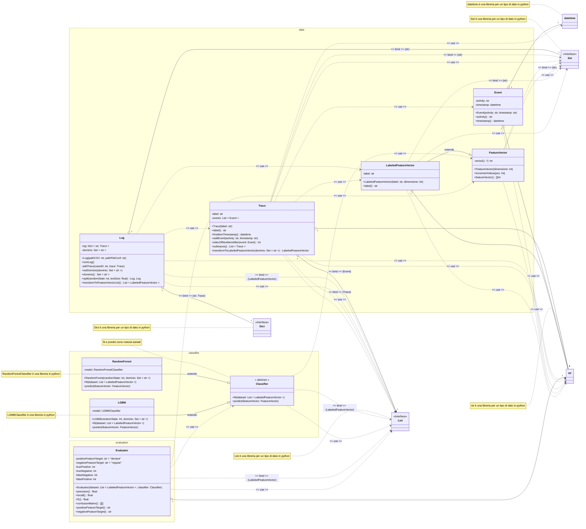

```mermaid
classDiagram
    direction LR
    note for datetime "datetime è una libreria per un tipo di dato in python"
    note for Dict "Dict è una libreria per un tipo di dato in python"
    note for str "str è una libreria per un tipo di dato in python"
    note for List "List è una libreria per un tipo di dato in python"
    note for Set "Set è una libreria per un tipo di dato in python"
    note for RandomForest "RandomForestClassifier è una libreria in python"
    note for LGBM "LGMBClassifier è una libreria in python"
    note for Classifier "fit e predict sono metodi astratti"
    Log "1" o-- "1" Dict : << bind >> (str, Trace)
    Trace "1" o-- "1" List : << bind >> (Event)
    Trace "1" o-- "1" str
    Event "1" o-- "1" str
    Event "1" o-- "1" datetime
    LabeledFeatureVector "1" o-- "1" str
    Log "1" o-- "1" Set : << bind >> (str)
    Evaluator "1" o-- "2" str
    Log ..> List : << bind >> (LabeledFeatureVector)
    Log ..> List : << use >> 
    Log ..> LabeledFeatureVector : << use >>
    Log ..> Trace : << use >>
    Log ..> str : << use >>
    Trace ..> str : << use >>
    Event ..> str : << use >>
    FeatureVector ..> str : << use >>
    LabeledFeatureVector ..> str : << use >>
    Trace ..> Event : << use >>
    Trace ..> List : << bind >> (Trace)
    Trace ..> List : << use >> 
    Trace ..> Set : << bind >> (str)
    Trace ..> Set : << use >> 
    Trace ..> LabeledFeatureVector : << use >>
    FeatureVector ..> Set : << bind >> (str)
    FeatureVector ..> Set : << use >>
    LabeledFeatureVector ..> Set : << bind >> (str)
    LabeledFeatureVector ..> Set : << use >>
    LabeledFeatureVector --|> FeatureVector : extends
    RandomForest --|> Classifier : extends
    LGBM --|> Classifier : extends
    Classifier ..> List : << bind >> (LabeledFeatureVector)
    Classifier ..> List : << use >> 
    Classifier ..> FeatureVector : << use >> 
    Evaluator ..> List : << bind >> (LabeledFeatureVector)
    Evaluator ..> List : << use >> 
    Evaluator ..> Classifier : << use >> 
    Evaluator ..> FeatureVector : << use >>
    Trace ..> datetime : << use >>

    namespace data {
        class Event {
            -activity: str
            -timestamp: datetime
            +Event(activity: str, timestamp: str)
            +activity() str
            +timestamp() datetime
        }

        class Trace {
            -label: str
            -events: List < Event >
            +Trace(label: str)
            +label() str
            +firstItemTimestamp() datetime
            +addEvent(activity: str, timestamp: str)
            -indexOfNextItemAfter(event: Event) int
            +subtraces() List < Trace >
            +transformToLabeledFeatureVector(dominio: Set < str >) LabeledFeatureVector
        }

        class Log {
            -log: Dict < str, Trace >
            -dominio: Set < str >
            +Log(pathCSV: str, pathFileConf: str)
            +sortLog()
            -addTrace(caseID: str, trace: Trace)
            +setDominio(dominio: Set < str >)
            +dominio() Set < str >
            +split(randomState: int, testSize: float) Log, Log
            +transformToFeatureVectorList() List < LabeledFeatureVector >
        }

        class FeatureVector {
            -vector[1..*]: Int
            +FeatureVector(dimensione: int)
            +incrementValue(pos: Int)
            +featureVector() []Int
        }

        class LabeledFeatureVector {
            -label: str
            +LabeledFeatureVector(label: str, dimensione: int)
            +label() str
        }

    }

    namespace classifier {
        class Classifier {
            << abstract >>
            +fit(dataset: List < LabeledFeatureVector >)
            +predict(featureVector: FeatureVector)
        }

        class RandomForest {
            -model: RandomForestClassifier
            +RandomForest(randomState: int, dominio: Set < str >)
            +fit(dataset: List < LabeledFeatureVector >)
            +predict(featureVector: FeatureVector)
        }

        class LGBM {
            -model: LGBMClassifier
            +LGBM(randomState: int, dominio: Set < str >)
            +fit(dataset: List < LabeledFeatureVector >)
            +predict(featureVector: FeatureVector)
        }
    }

    namespace evaluation {
        class Evaluator {
            -positiveFeatureTarget: str = "deviant"
            -negativeFeatureTarget: str = "regular"
            -truePositive: int
            -trueNegative: int
            -falseNegative: int
            -falsePositive: int
            +Evaluator(dataset: List < LabeledFeatureVector >, classifier: Classifier)
            +precision() float
            +recall() float
            +f1() float
            +confusionMatrix() [][]
            +positiveFeatureTarget() str
            +negativeFeatureTarget() str
        }
    }

    class Dict {
        <<Interface>>
    }

    class Set {
        <<Interface>>
    }

    class List {
        <<Interface>>
    }

    class str {

    }

    class datetime {

    }
```