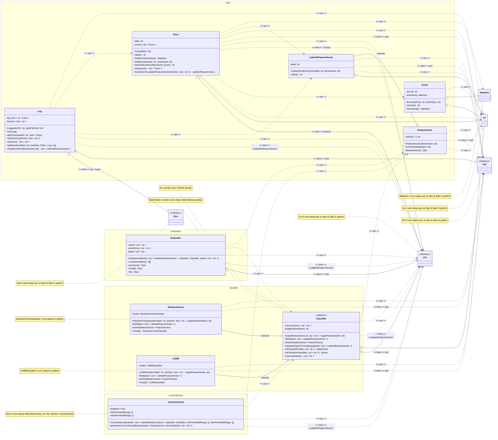

```mermaid
classDiagram
    direction LR
    note for datetime "datetime è una classe per un tipo di dato in python"
    note for Dict "Dict è una classe per un tipo di dato in python"
    note for str "str è una classe per un tipo di dato in python"
    note for List "List è una classe per un tipo di dato in python"
    note for Set "Set è una classe per un tipo di dato in python"
    note for RandomForest "RandomForestClassifier è una classe in python"
    note for LGBM "LGMBClassifier è una classe in python"
    note for Classifier "fit e predict sono metodi astratti"
    note for Classifier "DataFrame e Series sono classi della libreria pandas"
    note for Counterfactual "Dice è una classe della libreria dice_ml che calcola i counterfactual"
    Log "1" o-- "1" Dict : << bind >> (str, Trace)
    Trace "1" o-- "1" List : << bind >> (Event)
    Trace "1" o-- "1" str
    Event "1" o-- "1" str
    Event "1" o-- "1" datetime
    LabeledFeatureVector "1" o-- "1" str
    Log "1" o-- "1" Set : << bind >> (str)
    Evaluator "1" o-- "3" List : << bind >> (str)
    Classifier "1" o-- "1" List : << bind >> (str)
    Classifier "1" o-- "1" str
    Log ..> List : << bind >> (LabeledFeatureVector)
    Log ..> List : << use >> 
    Log ..> LabeledFeatureVector : << use >>
    Log ..> Trace : << use >>
    Log ..> str : << use >>
    Trace ..> str : << use >>
    Event ..> str : << use >>
    FeatureVector ..> str : << use >>
    LabeledFeatureVector ..> str : << use >>
    Trace ..> Event : << use >>
    Trace ..> List : << bind >> (Trace)
    Trace ..> List : << use >> 
    Trace ..> Set : << bind >> (str)
    Trace ..> Set : << use >> 
    Trace ..> LabeledFeatureVector : << use >>
    FeatureVector ..> Set : << bind >> (str)
    FeatureVector ..> Set : << use >>
    LabeledFeatureVector ..> Set : << bind >> (str)
    LabeledFeatureVector ..> Set : << use >>
    LabeledFeatureVector --|> FeatureVector : extends
    RandomForest --|> Classifier : extends
    LGBM --|> Classifier : extends
    LGBM ..> Set : << bind >> (str)
    LGBM ..> Set : << use >>
    RandomForest ..> Set : << bind >> (str)
    RandomForest ..> Set : << use >>
    Classifier ..> List : << bind >> (LabeledFeatureVector)
    Classifier ..> List : << use >> 
    Classifier ..> FeatureVector : << use >> 
    Evaluator ..> List : << bind >> (LabeledFeatureVector)
    Evaluator ..> List : << use >> 
    Evaluator ..> Classifier : << use >> 
    Evaluator ..> FeatureVector : << use >>
    Trace ..> datetime : << use >>
    Counterfactual ..> List : << bind >> (LabeledFeatureVector)
    Counterfactual ..> List : << use >> 
    Counterfactual ..> Classifier : << use >> 
    Counterfactual ..> FeatureVector : << use >>

    namespace data {
        class Event {
            -activity: str
            -timestamp: datetime
            +Event(activity: str, timestamp: str)
            +activity() str
            +timestamp() datetime
        }

        class Trace {
            -label: str
            -events: List < Event >
            +Trace(label: str)
            +label() str
            +firstItemTimestamp() datetime
            +addEvent(activity: str, timestamp: str)
            -indexOfNextItemAfter(event: Event) int
            +subtraces() List < Trace >
            +transformToLabeledFeatureVector(dominio: Set < str >) LabeledFeatureVector
        }

        class Log {
            -log: Dict < str, Trace >
            -dominio: Set < str >
            +Log(pathCSV: str, pathFileConf: str)
            +sortLog()
            -addTrace(caseID: str, trace: Trace)
            +setDominio(dominio: Set < str >)
            +dominio() Set < str >
            +split(randomState: int, trainSize: float) Log, Log
            +transformToFeatureVectorList() List < LabeledFeatureVector >
        }

        class FeatureVector {
            -vector[1..*]: Int
            +FeatureVector(dimensione: int)
            +incrementValue(pos: Int)
            +featureVector() []Int
        }

        class LabeledFeatureVector {
            -label: str
            +LabeledFeatureVector(label: str, dimensione: int)
            +label() str
        }

    }

    namespace classifier {
        class Classifier {
            << abstract >>
            -columnsName: List < str >
            -targetFeatureName: str
            +Classifier(columnsList: List < str >, targetFeatureName: str)
            +fit(dataset: List < LabeledFeatureVector >)
            +predict(featureVector: FeatureVector)
            +separateInputFromOutput(dataset: List < LabeledFeatureVector >)
            +toPandasDF(data: List < [] >) DataFrame
            +toPandasSeries(data: List < str >) Series
            +columnsName() List < str >
        }

        class RandomForest {
            -model: RandomForestClassifier
            +RandomForest(randomState: int, dominio: Set < str >, targetFeatureName: str)
            +fit(dataset: List < LabeledFeatureVector >)
            +predict(featureVector: FeatureVector)
            +model() RandomForestClassifier
            
        }

        class LGBM {
            -model: LGBMClassifier
            +LGBM(randomState: int, dominio: Set < str >, targetFeatureName: str)
            +fit(dataset: List < LabeledFeatureVector >)
            +predict(featureVector: FeatureVector)
            +model() LGBMClassifier
        }
    }

    namespace evaluation {
        class Evaluator {
            -actual: List < str >
            -predictions: List < str >
            -labels: List < str >
            +Evaluator(dataset: List < LabeledFeatureVector >, classifier: Classifier, labels: List < str >)
            +confusionMatrix() [][]
            +precision() float
            +recall() float
            +f1() float
        }
    }

    namespace counterfactual {
        class Counterfactual {
            -explainer: Dice
            -minPermittedRange: []
            -maxPermittedRange: []
            +Counterfactua(trainSet: List < LabeledFeatureVector>, classifier: Classifier, minPermittedRange: [], maxPermittedRange: [])
            +generateCounterfactual(featureVector: FeatureVector, columnsName: List < str >)
        }
    }

    class Dict {
        <<Interface>>
    }

    class Set {
        <<Interface>>
    }

    class List {
        <<Interface>>
    }

    class str {

    }

    class datetime {

    }
```